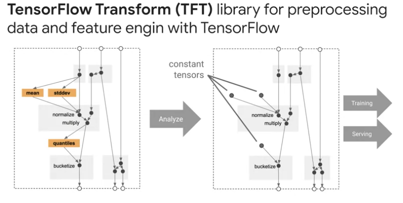

# Libraries

TFX component executors use several shared libraries to perform the actual component computation. 

## TFDV

- TensorFlow Data Validation helps developers understand, validate, and monitor their machine-learning data at scale.
- used to analyze and validate petabytes of data at Google every day and has a proven track record for helping TFX users maintain the health of their machine learning pipelines
- scalable calculations of summary statistics of training and test data
- integration with a viewer for data distributions and statistics
- faceted comparison of pairs of datasets using the facets library
- Automated data schema generation to describe expectations about data such as required values, ranges, and vocabularies
- a schema viewer to help you inspect the schema
- an anomaly detection to help you identify anomalies such as missing features, out of range values, or wrong feature types,
- anomalies viewer so that you can see what features have anomalies and learn more in order to correct them.

## Transform

- a library for pre-processing data and performing feature engineering with TensorFlow.
- It is useful for doing distributed compute using an Apache Beam on intensive data transformations, especially those that require a full dataset pass
- feature normalization, so computing the mean and standard deviation on the entire training set could also include generating vocabularies overall input values to compare it to string data to numeric representations
- converting unbounded float features to integer features by assigning them to buckets based on the observed training data distribution
- encodes ML best practices on feature engineering directly into your TensorFlow graph for pre-processing input data consistently for model training and serving.
- The same code that is transforming your raw data at training and serving time is also doing so at serving time to reduce train serving skew, which can negatively impact your model performance. 

## Tensorflow

- TensorFlow is used for training models with TFX. It ingests training data and modeling code and creates a SavedModel result. 
- It also integrates a feature engineering pipeline created by a TensorFlow Transform for pre-processing input data. 
- TFX supports nearly all of TensorFlow 2, with minor exceptions. TFX also fully supports TensorFlow 1.15 for backwards compatibility. 
- New TFX pipelines can use TensorFlow 2 with Keras models view that generic trainer.

## Tensorboard

- TensorBoard provides the visualization and tooling needed for machine learning experimentation, such as, tracking and visualizing metrics, such as loss in accuracy, visualizing the model graph, including operations and layers, viewing histograms of weight biases and other tensors as they change over time, projecting embeddings to a lower-dimensional space, displaying images, text and audio data, profiling in TensorFlow programs, and certainly much more via open-source extensions that are being added by the TensorFlow community. 
- TensorBoard is integrated directly into TFX. 
- During prototyping in a Jupyter Notebook, you can launch TensorBoard as a widget embedded in the notebook or as small web server from the command line to read from your pipelines log directory. 
- You can also use tensorboard.dev, which is a new service that lets you easily host, track, and share your experiment results.

## TFMA

- TensorFlow model analysis enables developers to compute and visualize evaluation metrics for their models. Before deploying any machine learning model, machine learning developers need to evaluate model performance to ensure that it meets specific quality thresholds and behaves as expected for all relevant slices of data.
- TensorFlow model analysis gives developers the tools to create a deep understanding of there model performance. 
- uses Apache Beam to scale model evaluation with your data, and adjust TF examples, and it has a series of Beam instructors and evaluators that compute metric slices and group combinations using a variety of transforms. 
- incorporate the Fairness Indicators library, which enables easy computation of commonly identified fair in this metrics for binary multi-class classifiers. 
- ou can compute commonly identified fairness metrics for classification levels, compare model performance across subgroups to a baseline or to other models, use confidence intervals to surface statistically significant disparities. 

wait, why do I need TensorBoard and TFMA for model evaluation? 
1. TensorBoard visualizes streaming whole model metrics that are computed from checkpoints during training. 
2. TFMA computes and visualizes metrics using an exported eval saved model format in batch to give you a much deeper granularity on your model's performance across slices.